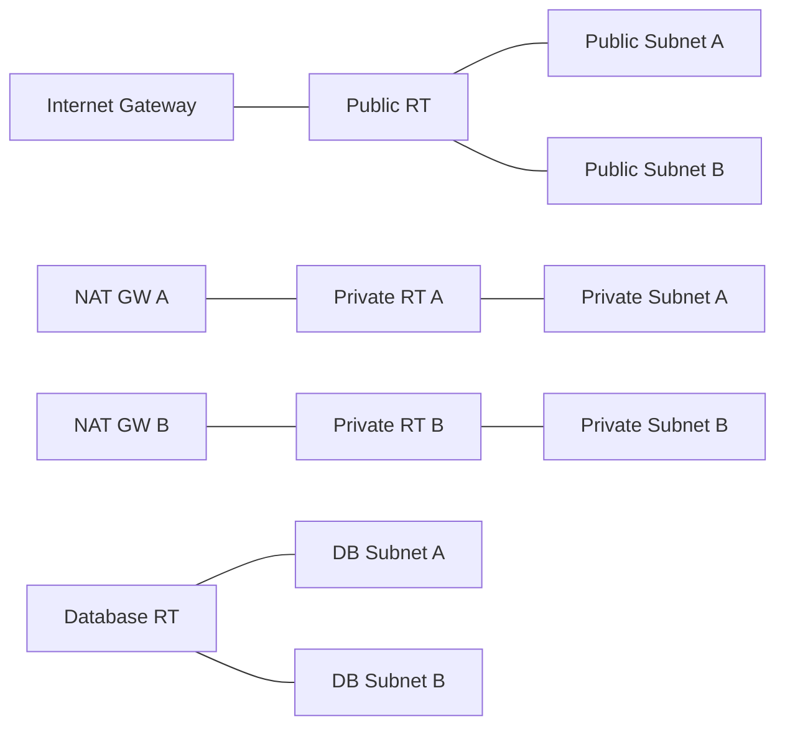

# Networking Stack

Reference composition that wires the networking modules into a complete multi-AZ VPC with public, private, and database tiers.

## Architecture



## Subnet Strategy
- One public, one private, and one database subnet per AZ.
- Public subnets optionally assign public IPs for ingress/egress via the Internet Gateway.
- Private subnets use NAT Gateways (one per AZ by default) for outbound-only access.
- Database subnets stay isolated; optional NAT routing is controllable via input.

## Route Behavior
- Public route table forwards `0.0.0.0/0` to the Internet Gateway.
- Private route tables forward `0.0.0.0/0` to NAT Gateways (HA optional).
- Database route table is isolated by default; can opt-in to NAT routing.

## Usage

```hcl
module "networking" {
  source = "github.com/your-org/infra-modules//terraform/stack/networking"

  name       = "core"
  cidr_block = "10.0.0.0/16"
  azs        = ["us-east-1a", "us-east-1b"]

  public_subnet_cidrs  = ["10.0.0.0/24", "10.0.1.0/24"]
  private_subnet_cidrs = ["10.0.10.0/24", "10.0.11.0/24"]
  database_subnet_cidrs = ["10.0.20.0/24", "10.0.21.0/24"]
}
```

<!-- BEGINNING OF PRE-COMMIT-TERRAFORM DOCS HOOK -->


## Requirements

| Name | Version |
|------|---------|
| <a name="requirement_terraform"></a> [terraform](#requirement\_terraform) | >= 1.0 |

## Providers

No providers.

## Modules

| Name | Source | Version |
|------|--------|---------|
| <a name="module_internet_gateway"></a> [internet\_gateway](#module\_internet\_gateway) | ../../internet_gateway | n/a |
| <a name="module_nat_gateway"></a> [nat\_gateway](#module\_nat\_gateway) | ../../nat_gateway | n/a |
| <a name="module_route_tables"></a> [route\_tables](#module\_route\_tables) | ../../route_table | n/a |
| <a name="module_security_group"></a> [security\_group](#module\_security\_group) | ../../security_group | n/a |
| <a name="module_subnets"></a> [subnets](#module\_subnets) | ../../subnet | n/a |
| <a name="module_vpc"></a> [vpc](#module\_vpc) | ../../vpc | n/a |

## Resources

No resources.

## Inputs

| Name | Description | Type | Default | Required |
|------|-------------|------|---------|:--------:|
| <a name="input_azs"></a> [azs](#input\_azs) | Availability zones to span the network across. | `list(string)` | n/a | yes |
| <a name="input_cidr_block"></a> [cidr\_block](#input\_cidr\_block) | CIDR block for the VPC. | `string` | n/a | yes |
| <a name="input_name"></a> [name](#input\_name) | Name prefix for networking resources. | `string` | n/a | yes |
| <a name="input_private_subnet_cidrs"></a> [private\_subnet\_cidrs](#input\_private\_subnet\_cidrs) | CIDR blocks for private subnets. | `list(string)` | n/a | yes |
| <a name="input_public_subnet_cidrs"></a> [public\_subnet\_cidrs](#input\_public\_subnet\_cidrs) | CIDR blocks for public subnets. | `list(string)` | n/a | yes |
| <a name="input_database_route_via_nat"></a> [database\_route\_via\_nat](#input\_database\_route\_via\_nat) | Route database subnets to the internet via NAT. | `bool` | `false` | no |
| <a name="input_database_subnet_cidrs"></a> [database\_subnet\_cidrs](#input\_database\_subnet\_cidrs) | CIDR blocks for database subnets. | `list(string)` | `[]` | no |
| <a name="input_enable_dns_hostnames"></a> [enable\_dns\_hostnames](#input\_enable\_dns\_hostnames) | Enable DNS hostnames in the VPC. | `bool` | `true` | no |
| <a name="input_enable_dns_support"></a> [enable\_dns\_support](#input\_enable\_dns\_support) | Enable DNS resolution in the VPC. | `bool` | `true` | no |
| <a name="input_enable_ipv6"></a> [enable\_ipv6](#input\_enable\_ipv6) | Enable IPv6 for the VPC and public subnets. | `bool` | `false` | no |
| <a name="input_enable_network_address_usage_metrics"></a> [enable\_network\_address\_usage\_metrics](#input\_enable\_network\_address\_usage\_metrics) | Enable VPC IP address usage metrics. | `bool` | `false` | no |
| <a name="input_instance_tenancy"></a> [instance\_tenancy](#input\_instance\_tenancy) | Instance tenancy for the VPC. | `string` | `"default"` | no |
| <a name="input_map_public_ip_on_launch"></a> [map\_public\_ip\_on\_launch](#input\_map\_public\_ip\_on\_launch) | Auto-assign public IPs to instances in public subnets. | `bool` | `true` | no |
| <a name="input_nat_per_az"></a> [nat\_per\_az](#input\_nat\_per\_az) | Create one NAT Gateway per AZ for high availability. | `bool` | `true` | no |
| <a name="input_tags"></a> [tags](#input\_tags) | Common tags applied to all networking resources. | `map(string)` | `{}` | no |
| <a name="input_workload_security_group_egress"></a> [workload\_security\_group\_egress](#input\_workload\_security\_group\_egress) | Egress rules for the default workload security group. | <pre>list(object({<br/>    description              = optional(string)<br/>    from_port                = number<br/>    to_port                  = number<br/>    protocol                 = string<br/>    cidr_blocks              = optional(list(string), [])<br/>    ipv6_cidr_blocks         = optional(list(string), [])<br/>    source_security_group_id = optional(string)<br/>  }))</pre> | <pre>[<br/>  {<br/>    "cidr_blocks": [<br/>      "0.0.0.0/0"<br/>    ],<br/>    "description": "Allow all outbound",<br/>    "from_port": 0,<br/>    "protocol": "-1",<br/>    "to_port": 0<br/>  }<br/>]</pre> | no |
| <a name="input_workload_security_group_ingress"></a> [workload\_security\_group\_ingress](#input\_workload\_security\_group\_ingress) | Ingress rules for the default workload security group. | <pre>list(object({<br/>    description              = optional(string)<br/>    from_port                = number<br/>    to_port                  = number<br/>    protocol                 = string<br/>    cidr_blocks              = optional(list(string), [])<br/>    ipv6_cidr_blocks         = optional(list(string), [])<br/>    source_security_group_id = optional(string)<br/>  }))</pre> | `[]` | no |

## Outputs

| Name | Description |
|------|-------------|
| <a name="output_database_subnet_ids"></a> [database\_subnet\_ids](#output\_database\_subnet\_ids) | IDs of database subnets. |
| <a name="output_private_subnet_ids"></a> [private\_subnet\_ids](#output\_private\_subnet\_ids) | IDs of private subnets. |
| <a name="output_public_subnet_ids"></a> [public\_subnet\_ids](#output\_public\_subnet\_ids) | IDs of public subnets. |
| <a name="output_route_tables"></a> [route\_tables](#output\_route\_tables) | Route table identifiers. |
| <a name="output_security_groups"></a> [security\_groups](#output\_security\_groups) | Security groups created by the stack. |
| <a name="output_vpc_id"></a> [vpc\_id](#output\_vpc\_id) | ID of the created VPC. |
<!-- END OF PRE-COMMIT-TERRAFORM DOCS HOOK -->

## Testing

```
cd tests/basic
terraform init -backend=false
terraform plan
```
